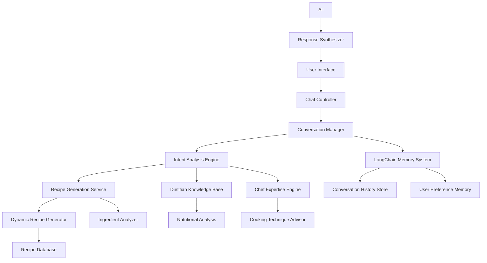

# Design Document

## Overview

The Intelligent Chef Assistant enhancement transforms the existing dashboard chat into a sophisticated culinary advisor that combines professional dietitian knowledge with AI chef expertise. The system uses LangChain for conversational memory, dynamic recipe generation (1-7 recipes), and contextual understanding to provide personalized cooking guidance.

## Architecture

### High-Level Architecture



### System Components

1. **Conversation Manager**: Orchestrates all chat interactions and maintains conversation flow
2. **LangChain Memory System**: Handles short-term and long-term conversation memory
3. **Intent Analysis Engine**: Determines user intent and context from messages
4. **Dynamic Recipe Generator**: Generates 1-7 recipes based on context and preferences
5. **Dietitian Knowledge Base**: Provides nutritional expertise and health guidance
6. **Chef Expertise Engine**: Delivers professional cooking techniques and tips

## Components and Interfaces

### 1. Enhanced Conversation Service

```typescript
interface ConversationService {
  // Enhanced conversation handling with memory
  processMessage(message: string, userId: string, sessionId: string): Promise<ConversationResponse>
  
  // LangChain memory integration
  getConversationMemory(sessionId: string): Promise<ConversationMemory>
  updateConversationMemory(sessionId: string, memory: ConversationMemory): Promise<void>
  
  // Intent analysis
  analyzeIntent(message: string, context: ConversationContext): Promise<UserIntent>
  
  // Context-aware response generation
  generateResponse(intent: UserIntent, memory: ConversationMemory): Promise<ConversationResponse>
}

interface ConversationResponse {
  message: string
  recipes?: Recipe[]
  nutritionalAdvice?: NutritionalAdvice
  cookingTips?: CookingTip[]
  followUpQuestions?: string[]
  recipeCount: number // 1-7 based on context
}

interface ConversationMemory {
  shortTermMemory: ShortTermMemory
  longTermMemory: LongTermMemory
  userPreferences: UserPreferences
  conversationHistory: ConversationTurn[]
}
```

### 2. LangChain Memory Integration

```typescript
interface LangChainMemoryService {
  // Memory management
  initializeMemory(userId: string, sessionId: string): Promise<ConversationBufferWindowMemory>
  
  // Conversation buffer with sliding window
  addToMemory(memory: ConversationBufferWindowMemory, input: string, output: string): Promise<void>
  
  // Long-term preference storage
  storeUserPreference(userId: string, preference: UserPreference): Promise<void>
  retrieveUserPreferences(userId: string): Promise<UserPreferences>
  
  // Conversation summarization
  summarizeConversation(conversationHistory: ConversationTurn[]): Promise<ConversationSummary>
  
  // Memory retrieval for context
  getRelevantMemory(query: string, userId: string): Promise<RelevantMemory>
}

interface ShortTermMemory {
  currentSession: ConversationTurn[]
  recentPreferences: UserPreference[]
  contextualIngredients: string[]
  currentMealContext: MealContext
}

interface LongTermMemory {
  dietaryRestrictions: DietaryRestriction[]
  favoriteIngredients: string[]
  cookingSkillLevel: SkillLevel
  preferredCuisines: string[]
  healthGoals: HealthGoal[]
  conversationSummaries: ConversationSummary[]
}
```

### 3. Dynamic Recipe Generation Engine

```typescript
interface DynamicRecipeGenerator {
  // Context-aware recipe generation
  generateRecipes(request: RecipeRequest, context: ConversationContext): Promise<Recipe[]>
  
  // Ingredient-based generation
  generateFromIngredients(ingredients: string[], preferences: UserPreferences): Promise<Recipe[]>
  
  // Determine optimal recipe count
  determineRecipeCount(intent: UserIntent, context: ConversationContext): number
  
  // Recipe customization
  customizeRecipe(baseRecipe: Recipe, preferences: UserPreferences): Promise<Recipe>
}

interface RecipeRequest {
  query: string
  ingredients?: string[]
  mealType?: MealType
  timeConstraints?: TimeConstraint
  servingSize?: number
  difficultyPreference?: DifficultyLevel
  nutritionalGoals?: NutritionalGoal[]
}

interface RecipeGenerationContext {
  userPreferences: UserPreferences
  conversationMemory: ConversationMemory
  availableIngredients: string[]
  kitchenEquipment: Equipment[]
  timeOfDay: string
  seasonalContext: SeasonalContext
}
```

### 4. Professional Dietitian Knowledge System

```typescript
interface DietitianKnowledgeService {
  // Nutritional analysis
  analyzeNutritionalContent(recipe: Recipe): Promise<NutritionalAnalysis>
  
  // Health-based recommendations
  getHealthRecommendations(userProfile: UserHealthProfile): Promise<HealthRecommendation[]>
  
  // Dietary restriction handling
  validateDietaryCompliance(recipe: Recipe, restrictions: DietaryRestriction[]): Promise<ComplianceResult>
  
  // Meal planning guidance
  createBalancedMealPlan(preferences: UserPreferences, duration: number): Promise<MealPlan>
  
  // Ingredient health benefits
  getIngredientHealthBenefits(ingredient: string): Promise<HealthBenefit[]>
}

interface NutritionalAnalysis {
  calories: number
  macronutrients: Macronutrients
  micronutrients: Micronutrient[]
  healthScore: number
  dietaryFiberContent: number
  sodiumContent: number
  sugarContent: number
  healthBenefits: string[]
  nutritionalWarnings?: string[]
}

interface HealthRecommendation {
  category: 'weight_management' | 'heart_health' | 'diabetes_friendly' | 'muscle_building'
  recommendation: string
  scientificBasis: string
  applicableRecipes: string[]
}
```

### 5. Chef Expertise Engine

```typescript
interface ChefExpertiseService {
  // Cooking technique guidance
  getCookingTechniques(recipe: Recipe): Promise<CookingTechnique[]>
  
  // Professional tips
  getChefTips(cookingMethod: string, ingredients: string[]): Promise<ChefTip[]>
  
  // Equipment recommendations
  recommendEquipment(recipe: Recipe): Promise<EquipmentRecommendation[]>
  
  // Flavor enhancement suggestions
  suggestFlavorEnhancements(recipe: Recipe, userPreferences: UserPreferences): Promise<FlavorEnhancement[]>
  
  // Cooking troubleshooting
  provideCookingTroubleshooting(issue: CookingIssue): Promise<TroubleshootingSolution>
}

interface CookingTechnique {
  name: string
  description: string
  difficulty: DifficultyLevel
  timeRequired: string
  equipmentNeeded: string[]
  tips: string[]
  commonMistakes: string[]
}

interface ChefTip {
  category: 'preparation' | 'cooking' | 'seasoning' | 'presentation'
  tip: string
  reasoning: string
  applicableSteps: number[]
}
```

## Data Models

### Enhanced Recipe Model

```typescript
interface Recipe {
  id: string
  title: string
  description: string
  ingredients: EnhancedIngredient[]
  instructions: EnhancedInstruction[]
  cookingTime: string
  prepTime: string
  totalTime: string
  servings: number
  difficulty: DifficultyLevel
  tags: string[]
  cuisine: string
  mealType: MealType[]
  
  // Enhanced nutritional information
  nutritionalInfo: NutritionalAnalysis
  healthBenefits: HealthBenefit[]
  dietaryCompliance: DietaryCompliance
  
  // Professional insights
  chefTips: ChefTip[]
  cookingTechniques: CookingTechnique[]
  equipmentRecommendations: EquipmentRecommendation[]
  
  // Customization options
  substitutions: IngredientSubstitution[]
  scalingOptions: ScalingOption[]
  flavorVariations: FlavorVariation[]
  
  // AI generation metadata
  generationContext: GenerationContext
  confidenceScore: number
  imageUrl?: string
}

interface EnhancedIngredient {
  name: string
  amount: string
  unit: string
  category: IngredientCategory
  nutritionalValue: NutritionalValue
  seasonality: SeasonalInfo
  substitutions: string[]
  preparationNotes?: string
}

interface EnhancedInstruction {
  step: number
  instruction: string
  technique?: CookingTechnique
  timeEstimate: string
  temperature?: string
  visualCues: string[]
  commonMistakes: string[]
  chefTips: string[]
}
```

### Conversation Context Model

```typescript
interface ConversationContext {
  userId: string
  sessionId: string
  currentIntent: UserIntent
  conversationHistory: ConversationTurn[]
  userPreferences: UserPreferences
  availableIngredients: string[]
  timeContext: TimeContext
  mealContext: MealContext
  nutritionalGoals: NutritionalGoal[]
  cookingConstraints: CookingConstraint[]
}

interface UserIntent {
  type: IntentType
  confidence: number
  entities: ExtractedEntity[]
  recipeCountPreference: number
  specificRequirements: string[]
}

type IntentType = 
  | 'recipe_request'
  | 'ingredient_based_cooking'
  | 'nutritional_advice'
  | 'cooking_technique_help'
  | 'meal_planning'
  | 'dietary_modification'
  | 'cooking_troubleshooting'
```

## Error Handling

### Conversation Error Management

```typescript
interface ConversationErrorHandler {
  handleMemoryError(error: MemoryError): Promise<ErrorResponse>
  handleRecipeGenerationError(error: GenerationError): Promise<ErrorResponse>
  handleNutritionalAnalysisError(error: AnalysisError): Promise<ErrorResponse>
  handleIntentAnalysisError(error: IntentError): Promise<ErrorResponse>
}

interface ErrorResponse {
  fallbackMessage: string
  suggestedActions: string[]
  retryStrategy: RetryStrategy
  userGuidance: string
}
```

### Graceful Degradation

1. **Memory Service Failure**: Fall back to session-only memory
2. **Recipe Generation Failure**: Provide simplified recipes from cache
3. **Nutritional Analysis Failure**: Offer basic nutritional estimates
4. **Intent Analysis Failure**: Ask clarifying questions

## Testing Strategy

### Unit Testing

1. **LangChain Memory Integration Tests**
   - Memory storage and retrieval accuracy
   - Conversation summarization quality
   - User preference persistence

2. **Recipe Generation Tests**
   - Dynamic recipe count generation (1-7)
   - Ingredient-based recipe accuracy
   - Nutritional analysis correctness

3. **Intent Analysis Tests**
   - Context understanding accuracy
   - Entity extraction precision
   - Intent classification reliability

### Integration Testing

1. **End-to-End Conversation Flow**
   - Multi-turn conversation coherence
   - Memory persistence across sessions
   - Recipe generation quality

2. **Professional Knowledge Validation**
   - Dietitian advice accuracy
   - Chef technique correctness
   - Nutritional information reliability

### Performance Testing

1. **Memory System Performance**
   - Memory retrieval speed
   - Conversation summarization efficiency
   - Large conversation history handling

2. **Recipe Generation Performance**
   - Generation time for 1-7 recipes
   - Concurrent user handling
   - Database query optimization

## Implementation Considerations

### LangChain Integration

- Use `ConversationBufferWindowMemory` for short-term context
- Implement `ConversationSummaryBufferMemory` for long-term storage
- Create custom memory classes for user preference persistence
- Utilize `VectorStoreRetrieverMemory` for semantic recipe retrieval

### Professional Knowledge Integration

- Integrate USDA nutritional database for accurate nutritional analysis
- Implement evidence-based dietary guidelines from nutrition science
- Create comprehensive cooking technique database with professional insights
- Establish ingredient seasonality and sourcing information

### Scalability Considerations

- Implement conversation memory cleanup strategies
- Use caching for frequently accessed nutritional data
- Optimize recipe generation algorithms for performance
- Design for horizontal scaling of memory services

This design provides a comprehensive foundation for transforming the dashboard chat into an intelligent, professional-grade culinary assistant that remembers conversations, provides expert guidance, and generates contextually appropriate numbers of recipes based on user needs.